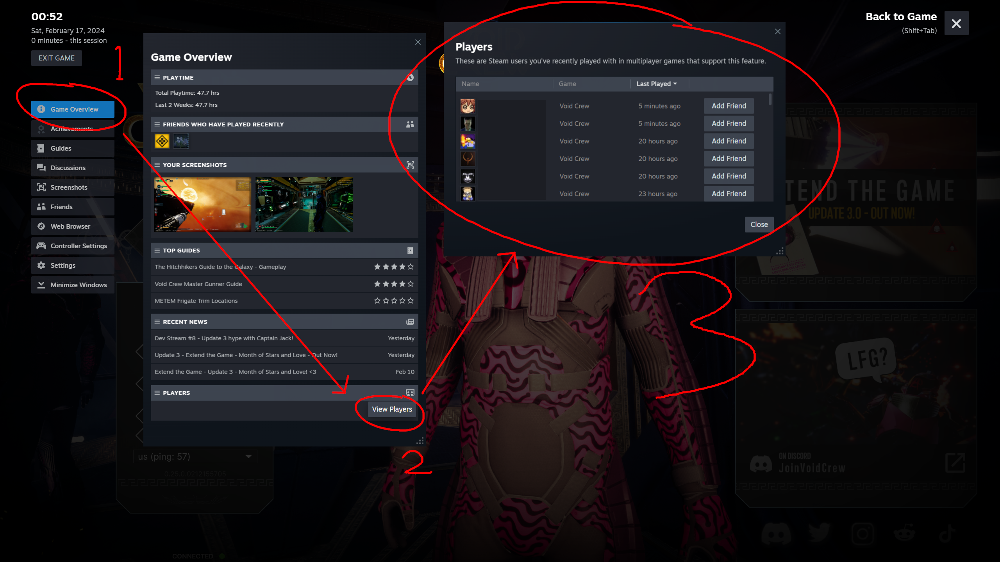

# Recent Players

Populates the Steam overlay's recent players section with players you've been in a lobby with. This lets you easily send friend requests to people who have been in your lobby. No more missed connections!

## Usage

To make use of this mod, open your steam overlay and:

1. Open the Game Overview. The button will either be listed on the right or an icon on the bottom depending on your Steam settings.
2. Press the "View Players" button. You may have to scroll down to find it.
3. Add friends as you please!

## Manual Installation

1. Install [BepInEx 5](https://github.com/BepInEx/BepInEx) into your Void Crew game folder. This mod is NOT made for
   BepInEx 6.
2. Add `RecentPlayers.dll` from the latest [release](https://github.com/zkxs/VoidCrewMods/releases) to your BepInEx `plugins`
   folder. If `plugins` doesn't exist, simply create the folder inside your `BepInEx` folder.

If you did everything correctly, you should have `RecentPlayers.dll` at this location:
`C:\Program Files (x86)\Steam\steamapps\common\Void Crew\BepInEx\plugins\RecentPlayers.dll` (at least for a typical Steam
install).

## License

Copyright 2024 [Michael Ripley](https://github.com/zkxs).

RecentPlayers is provided under the [MIT License](LICENSE).
